# **Multi-Layer Whiteboard LIVE Demo Integration Plan**

## **Current Situation**

✅ **System Built:** Multi-layered whiteboard completely implemented with all features
❌ **Not Integrated:** Still showing original SimpleWhiteboard in your Classroom tab
🎯 **Next Step:** Activate the multi-layer system in your live interface

---

## **Immediate Demo Options**

### **Option A: Replace Live Classroom (Recommended)**

**Files to Modify:**

- `[tutorme-app/src/app/tutor/live-class/page.tsx](tutorme-app/src/app/tutor/live-class/page.tsx)` - Replace current SimpleWhiteboard
- Integration: Replace lines 854-903 with EnhancedTeachingInterface

**What You'll See:**

- Current Classroom tab completely transformed
- Multi-layer canvas with student gallery on right
- Real-time collaboration buttons
- Layer management controls
- Broadcasting at 90% overlay to students

### **Option B: Create Demo Route (Safe Testing)**

**New Route:** `/tutor/demo/multilayer`
**Files to Create:**

- `[tutorme-app/src/app/tutor/demo/multilayer/page.tsx](tutorme-app/src/app/tutor/demo/multilayer/page.tsx)`
- Standalone demonstration with fake students
- Test all features without affecting production

### **Option C: Hybrid Integration (Moderate Change)**

**Files to Modify:**

- Add EnhancedTeachingInterface alongside existing SimpleWhiteboard
- Toggle switch to switch between interfaces
- Test new features while keeping old as fallback

---

## **What You'll See After Integration**

```mermaid
graph TD
    A[Current Classroom Tab] --> B[Choose Integration Method]
    B --> C[Replace Content]
    B --> D[Add New Route]
    B --> E[Hybrid Toggle]
    
    C --> F[📱 New Interface Shows]
    D --> G[🎬 Demo Route Shows]
    E --> H[🔨 Both Available]
    
    F --> I[Multi-Layer Canvas 60%]
    F --> J[Student Gallery 25%]
    F --> K[Controls 15%]
    
    I --> L[Broadcast 90% to Students]
    I --> M[Personal Layer 100% to Tutor]
    I --> N[Cross-User Writing Enabled]
    
    J --> O[Live Board Previews]
    J --> P[Click to View Student Work]
    J --> Q[Permission Indicators]
    
    K --> R[Layer Controls]
    K --> S[Save Session]
    K --> T[Start/Stop Broadcast]
```




---

## **Quick Implementation Plan**

### **Step 1: Choose Your Path (Pick One)**

#### **A) LIVE INTEGRATION (Immediate)**

```tsx
// IN tutorme-app/src/app/tutor/live-class/page.tsx
// REPLACE lines starting at "Classroom Tab - Live view..."

<TabsContent value="classroom" className="absolute inset-0">
  <EnhancedTeachingInterface
    sessionId={roomId}
    students={students}
    onStudentSelect={(studentId) => handleStudentSelect(studentId)}
  />
</TabsContent>
```

#### **B) DEMO ROUTE (Testing First)**

```tsx
// CREATE tutorme-app/src/app/tutor/demo/multilayer/page.tsx
// Add standalone demo page

import { EnhancedTeachingInterface } from '@/app/tutor/live-class/components/EnhancedTeachingInterface'

export default function MultiLayerDemo() {
  const mockStudents = [
    { id: 'stu1', name: 'Alice', status: 'active', engagement: 85 },
    { id: 'stu2', name: 'Bob', status: 'needs_help', engagement: 45 },
    // ... add test students
  ]
  
  return (
    <div className="h-screen">
      <EnhancedTeachingInterface
        sessionId="demo-session-123"
        students={mockStudents}
        isSocketConnected={true}
      />
    </div>
  )
}
```

### **Step 2: Test the Features**

**You'll See These New Buttons:**

- 📡 **"New Broadcast"** - Start 90% overlay broadcast
- 🎓 **"Student Boards"** - Gallery of all student whiteboards  
- 📺 **"Start/Stop Broadcast"** - Toggle live broadcasting
- 🔐 **Permission Controls** - Grant cross-user access
- 💾 **"Save Session"** - Persist all layers automatically

**What Students Will See:**

- Your words/drawings appear as 90% overlay on their screen
- They can write on their own personal layers
- They can share their boards when invited

---

## **Which Option Do You Want?**

### **Option A: Go Live Now**

- **Risk:** Immediate change to your interface
- **Reward:** See real features immediately
- **Complexity:** 5 minute update

### **Option B: Demo First**

- **Risk:** Zero - separate test route
- **Reward:** Full feature preview
- **Complexity:** 10 minutes to set up

### **Option C: Hybrid Approach**

- **Risk:** Minimal - both interfaces available
- **Reward:** Compare old vs new
- **Complexity:** 15 minutes

**Status: Ready for Immediate Implementation!** 🚀

Which demo path would you like me to activate so you can see the multi-layer whiteboard features in action?