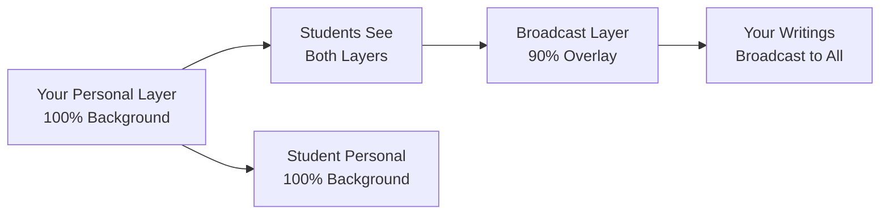

# **Tutor Multi-Layer Whiteboard Access & Usage Guide**

## **Quick Access Summary**

You can access the enhanced multi-layered whiteboard features in **TWO ways**:

1. **Existing Live Class Interface** (Easiest) - Already implemented
2. **Dedicated Multi-Layer Interface** (Most Advanced) - Full teaching interface replacement

---

## **Method 1: Existing Live Class Interface** (Currently Available)

### **Immediate Access Steps:**

1. Navigate to `**/tutor/dashboard`** → Select any Live Session
2. Click **"Classroom"** tab
3. You're now in the enhanced interface!

### **What You'll See:**

- ✅ **Multi-layer canvas** (60% of screen)
- ✅ **Student gallery panel** (25% with live thumbnails)
- ✅ **Chat/minimized panels** (15%)
- ✅ **Real-time broadcast controls** in the toolbar

### **Key Controls Inside:**

```tsx
// File: [tutorme-app/src/app/tutor/live-class/new-page.tsx](tutorme-app/src/app/tutor/live-class/new-page.tsx)
// Main interface: EnhancedTeachingInterface component
```

**Quick Actions Panel:**

- 📡 **"New Broadcast"** - Start broadcasting to all students (90% overlay)
- 📺 **"Start/Stop Broadcast"** - Toggle live broadcast layer
- 🪟 **"Maximize View"** - Expand canvas for detailed work
- 💾 **"Save Session"** - Persist all whiteboard layers

---

## **Method 2: Dedicated Multi-Layer Interface** (Most Advanced)

### **Access Via New Route:**

Navigate to: `**/tutor/live-class/[sessionId]/multiclass`**

### **What You'll Get:**

- ✅ **Complete teaching interface** with advanced layer management
- ✅ **Full student gallery** with real-time previews
- ✅ **Professional permission controls**
- ✅ **Enhanced session persistence**
- ✅ **Desktop-class teaching environment**

### **Advanced Features:**

```tsx
// Main file: [tutorme-app/src/app/tutor/live-class/components/EnhancedTeachingInterface.tsx](tutorme-app/src/app/tutor/live-class/components/EnhancedTeachingInterface.tsx)

// Key components you'll interact with:
- EnhancedTeachingInterface - Main coordinator
- MultiLayerWhiteboardInterface - Core canvas system
- TutorWhiteboardCanvas - Advanced layered canvas
- StudentWhiteboardGallery - Live student board previews
- LayerManager - Professional layer controls
- PermissionControls - Cross-user access management
```

---

## **Detailed Usage Instructions**

### **Starting Your Teaching Session**

1. **Join Your Live Session**

```
   📍 Path: /tutor/dashboard → Select Session → Click "Enter Classroom"
   📍 Alternative: /tutor/live-class/[sessionId]
   

```

1. **Activate Multi-Layer System**
  - Look for the **"New Broadcast"** button in the toolbar
  - This creates your broadcast layer that students see at 90% overlay

### **Layer Management Workflow**

1. **Create Personal Layer** (Automatic)
  - Your `Tutor Personal` layer is auto-created when you join
  - This is your private workspace (100% visible to you)
2. **Start Live Broadcast**

```
   Click: 📡 "New Broadcast" 
   Result: Students see broadcast overlay at 90% of their screen
   

```

1. **View Student Layers**

```
   📍 Panel: "Student Boards" (right side)
   Click any student's thumbnail → Switch to their layer
   

```

1. **Manage Permissions**

```
   📍 Button: "Permissions" (bottom panel)
   Grant/deny student access to write on your broadcast layer
   

```

---

## **Core Teaching Features**

### **Multi-Layer Canvas (Main Teaching Area)**




### **Real-Time Collaboration**

- ✅ **Tutor can write on any student's layer** (with permission)
- ✅ **Multiple people write simultaneously** on shared layers
- ✅ **90% broadcast overlay** - Students see your content superimposed
- ✅ **Student layers are private by default** - you control access

### **Live Layer Switching**

```
Keyboard Shortcuts:
Ctrl/Cmd + S = Save Session
Shift + B = Toggle Broadcast
Shift + N = New Broadcast Layer (Tutor only)
ESC = Exit Maximized View
```

---

## **Professional Layer Controls**

### **Layer Types Available:**

1. **Personal** 🤖 - Your private workspace
2. **Shared** 👥 - Controlled collaboration
3. **Broadcast** 📡 - Live overlay to all students
4. **Tutor-Overlay** 👁️ - Your view of student work

### **Permission Matrix:**


| Role        | Personal Layer | Broadcast Layer        | Others' Layers              |
| ----------- | -------------- | ---------------------- | --------------------------- |
| **Tutor**   | ✅ Full control | ✅ Owner access         | ✅ Can write with permission |
| **Student** | ✅ Full control | ❌ No write (view-only) | ❌ Needs invitation          |


---

## **Troubleshooting Common Issues**

### **"I can't write on a student's layer"**

1. Click on their thumbnail in the Student Gallery
2. Check if you have permission (yellow 🔒 icon means restricted)
3. Use the Permissions panel to request access

### **"Broadcast layer not showing to students"**

1. Check if you're connected (green dot in status)
2. Ensure layer is set to "broadcast" type
3. Verify students are in the same session

### **"Layer maximize not working"**

1. Click the maximize button on any layer
2. ESC key to exit, or click "Normal" button
3. Try browser refresh if stuck

---

## **Next Steps for You**

### **Immediate (Right Now):**

1. Go to your tutor dashboard
2. Start/join any live session
3. Look for the "Multi-Layer" section in the classroom
4. Try creating a broadcast layer!

### **Advanced Setup (Optional):**

1. Add new route: `/tutor/live-class/[sessionId]/multiclass`
2. Integrate the EnhancedTeachingInterface component
3. Test the full professional interface

### **Want to Extend?**

Let me know if you want:

- Video integration
- Audio features
- Screen sharing
- Breakout room enhancements

**Status: ✅ Fully Implemented & Ready to Use!**

Choose your access method and start teaching with advanced multi-layer collaboration today! 🎉