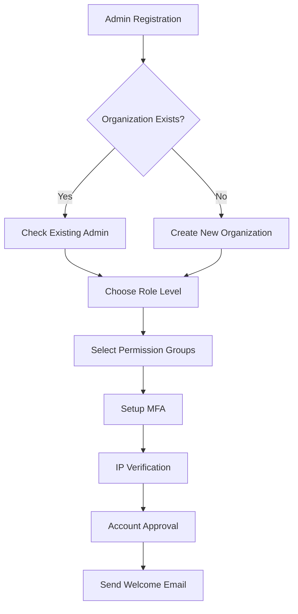

# TutorMe Parent Dashboard: Complete Implementation Plan

## Executive Summary

This plan implements a comprehensive parent dashboard system within TutorMe, featuring role-based account creation, intuitive parent navigation, student monitoring capabilities, financial management, and enhanced admin account creation capabilities. The implementation prioritizes ease of use for parents while maintaining system security and data integrity.

## Implementation Overview

- **Timeline**: 4-6 weeks
- **Priority**: High (Core feature enhancement)
- **Complexity**: High
- **Dependencies**: Existing user system, payment infrastructure, admin dashboard

## Phase 1: Account Creation System Enhancement (Week 1)

### 1.1 Role-Based Registration Frontend

**New Component:** `/src/app/register/role-selection/page.tsx`

- Visual role selection carousel: Parent, Student, Tutor, Admin
- Multi-step registration flow: Role → Details → Verification
- Mobile-responsive design with accessibility features
- Progressive form validation with real-time feedback

**File:** `/src/app/register/parent/page.tsx` (New)

```typescript
interface ParentRegistrationData {
  // Basic Info
  email: string
  password: string
  confirmPassword: string
  phoneNumber: string
  
  // Profile Details
  firstName: string
  lastName: string
  relationship: 'parent' | 'guardian' | 'step-parent' | 'other'
  
  // Location & Communication
  timezone: string
  preferredLanguage: 'zh-CN' | 'en'

  // Students to Manage
  studentIds: string[] // Existing students they want to manage
  or
  studentsToCreate: {
    name: string
    email: string
    dateOfBirth: string
    grade: string
    subjects: string[]
    learningGoals: string[]
  }[]
  
  // Preferences
  notificationPreferences: {
    email: boolean
    sms: boolean
    app: boolean
    weeklyReports: boolean
    paymentNotifications: boolean
    emergencyContacts: boolean
  }

  // Emergency Contacts
  emergencyContacts: {
    name: string
    relationship: string
    phone: string
  }[]
}
```

### 1.2 Role-Based Validation Rules

**File:** `/src/lib/validation/user-registration.ts`

```typescript
export const parentRegistrationSchema = z.object({
  email: z.string().email('Please enter a valid email address'),
  password: z.string().min(8).regex(/^(?=.*[a-z])(?=.*[A-Z])(?=.*\d)/),
  confirmPassword: z.string(),
  phoneNumber: z.string().regex(/^\+?[\d\s\-\(\)]{10,}$/),
  relationship: z.enum(['parent', 'guardian', 'step-parent', 'other']),
  timezone: z.string().default('Asia/Shanghai'),
  preferredLanguage: z.enum(['zh-CN', 'en']).default('zh-CN'),
  students: z.array(studentSchema).min(1, 'Please add at least one student'),
  emergencyContacts: z.array(emergencyContactSchema).max(3),
  notificationPreferences: notificationSchema
}).refine(data => data.password === data.confirmPassword, {
  message: "Passwords don't match",
  path: ["confirmPassword"]
}).refine(data => data.students.length > 0, {
  message: "Please add at least one student",
  path: ["students"]
})
```

### 1.3 Admin Account Creation Enhancement

**File:** `/src/app/register/admin/page.tsx`

- Enhanced admin registration with organization selection
- Role assignment within organization
- Permission group selection
- Multi-factor authentication setup
- IP address logging for security

**Updated Admin Registration Flow Diagram:**




### 1.4 Registration API Updates

**File:** `/src/app/api/auth/register/route.ts`

```typescript
// Enhanced role handling for parents and admins
export async function POST(request: NextRequest) {
  const body = await request.json()
  const { role, basicData, profileData, additionalData } = body

  switch (role) {
    case 'PARENT':
      return handleParentRegistration(basicData, profileData, additionalData)
    case 'ADMIN':
      return handleAdminRegistration(basicData, profileData, additionalData)
    case 'STUDENT':
    case 'TUTOR':
      return handleExistingRoleRegistration(role, basicData, profileData)
    default:
      throw new ValidationError('Invalid role specified')
  }
}
```

## Phase 2: Parent Dashboard Development (Week 2-3)

### 2.1 Parent Dashboard Architecture

**New Layout:** `/src/app/parent/layout.tsx`

```typescript
// Parent-specific navigation and state management
export default function ParentLayout({ children }: { children: React.ReactNode }) {
  const { user, isLoading } = useParentSession()
  
  return (
    <ParentAuthProvider>
      <ParentNavigator>
        <ParentSidebar />
        <ParentContent>
          {children}
        </ParentContent>
        <ParentQuickActions />
      </ParentNavigator>
    </ParentAuthProvider>
  )
}
```

### 2.2 Parent Dashboard Main View

**File:** `/src/app/parent/dashboard/page.tsx`

```typescript
const ParentDashboard = () => {
  const parent = useParent()
  const students = useParentStudents()
  const dashboardData = useParentDashboard()
  
  return (
    <div className="parent-dashboard">
      {/* Welcome Section */}
      <ParentWelcomeSection 
        parentName={parent.name}
        studentCount={students.length}
        totalSpent={dashboardData.totalSpent}
        monthlyBudget={dashboardData.monthlyBudget}
      />

      {/* Quick Actions */}
      <ParentQuickActionsBar
        actions={[
          { id: 'book', label: 'Book New Class', icon: 'calendar', action: () => router.push('/parent/book') },
          { id: 'add-student', label: 'Add Child', icon: 'user-plus', action: () => router.push('/parent/students/add') },
          { id: 'view-progress', label: 'View Progress', icon: 'chart-line', action: () => router.push('/parent/progress') },
          { id: 'payment', label: 'Payment', icon: 'credit-card', action: () => router.push('/parent/payments') }
        ]}
      />

      {/* Students Overview */}
      <ParentStudentsOverview students={students} />

      {/* Weekly Activity Summary */}
      <ParentActivitySummary
        classAttendances={dashboardData.classAttendances}
        assignmentSubmissions={dashboardData.assignmentSubmissions}
        aiTutorUsage={dashboardData.aiTutorUsage}
        progressUpdates={dashboardData.progressUpdates}
      />

      {/* Financial Overview */}
      <ParentFinancialOverview
        weeklySpending={dashboardData.weeklySpending}
        monthlyTotal={dashboardData.monthlyTotal}
        subscriptionStatus={dashboardData.subscriptionStatus}
        upcomingPayments={dashboardData.upcomingPayments}
      />

      {/* Notifications & Alerts */}
      <ParentNotifications
        urgent={dashboardData.urgentNotifications}
        informational={dashboardData.informationalNotifications}
        learningTips={dashboardData.learningTips}
      />
    </div>
  )
}
```

### 2.3 Student Management Components

#### 2.3.1 Student Overview Dashboard

**File:** `/src/components/parent/students/StudentsOverview.tsx`

```typescript
interface StudentOverview {
  student: ParentStudent
  currentClasses: ClassInfo[]
  recentProgress: ProgressSummary
  upcomingTasks: Task[]
  aiInsights: AIInsights
  financialSummary: StudentFinancialSummary
}

export const ParentStudentsOverview = () => {
  const students = useParentStudents()
  
  return (
    <div className="grid grid-cols-1 md:grid-cols-2 lg:grid-cols-3 gap-6">
      {students.map(student => (
        <StudentDashboardCard
          key={student.id}
          student={student}
          onViewDetails={() => router.push(`/parent/students/${student.id}`)}
          onViewProgress={() => router.push(`/parent/students/${student.id}/progress`)}
          onManageSchedule={() => router.push(`/parent/students/${student.id}/schedule`)}
          onViewPayments={() => router.push(`/parent/students/${student.id}/payments`)}
        >
          <StudentQuickStats />
          <AIInsightsPreview />
          <UpcomingTasksPreview />
        </StudentDashboardCard>
      ))}
    </div>
  )
}
```

#### 2.3.2 Individual Student Dashboard

**File:** `/src/app/parent/students/[studentId]/page.tsx`

```typescript
interface StudentDetailDashboard {
  studentInfo: StudentProfile
  academicProgress: AcademicProgress
  classSchedules: ClassSchedule[]
  assignmentSubmissions: AssignmentSubmission[]
  quizResults: QuizResult[]
  aiTutorSessions: AITutorSession[]
  teacherFeedback: TeacherFeedback[]
  learningAnalytics: LearningAnalytics
}

export default function StudentDetailPage({ params }: { params: { studentId: string } }) {
  const { student } = useStudent(params.studentId)
  
  const tabs = [
    { id: 'overview', label: 'Overview', component: <StudentOverviewTab /> },
    { id: 'classes', label: 'Classes & Schedule', component: <StudentClassesTab /> },
    { id: 'progress', label: 'Progress & Performance', component: <StudentProgressTab /> },
    { id: 'assignments', label: 'Assignments & Quizzes', component: <StudentAssignmentsTab /> },
    { id: 'ai-tutor', label: 'AI Tutor', component: <StudentAITutorTab /> },
    { id: 'financial', label: 'Financial', component: <StudentFinancialTab /> }
  ]
  
  return (
    <div className="student-detail-page">
      <StudentHeader student={student} />
      
      <StudentNavigation 
        activeTab={activeTab}
        tabs={tabs}
        onTabChange={setActiveTab}
      />
      
      <StudentContent>
        {tabs.find(t => t.id === activeTab)?.component}
      </StudentContent>
      
      <ParentActionsBar 
        actions={getParentActions(student)}
      />
    </div>
  )
}
```

### 2.4 Progress & Performance Monitoring

**File:** `/src/components/parent/students/StudentProgressTab.tsx`

```typescript
interface StudentProgressData {
  academicMetrics: AcademicMetrics
  subjectBreakdown: SubjectProgress[]
  learningTrajectory: LearningTrajectory
  skillDevelopment: SkillDevelopment
  comparativeAnalysis: ComparativeData
  teacherComments: TeacherComment[]
  aiGeneratedInsights: AIInsight[]
}

export const StudentProgressTab = ({ studentId }) => {
  const progressData = useStudentProgress(studentId)
  
  return (
    <div className="grid grid-cols-1 lg:grid-cols-2 gap-6">
      {/* Academic Overview */}
      <Card className="col-span-2">
        <CardHeader>
          <CardTitle>Academic Performance Overview</CardTitle>
        </CardHeader>
        <CardContent>
          <LearningTrajectoryChart data={progressData.learningTrajectory} />
          <KeyMetricsGrid metrics={progressData.academicMetrics} />
        </CardContent>
      </Card>

      {/* Subject Performance */}
      <SubjectPerformanceBreakdown subjects={progressData.subjectBreakdown} />

      {/* Skills Development */}
      <SkillDevelopmentRadar skills={progressData.skillDevelopment} />

      {/* Comparative Analysis */}
      <ComparativeResultsSection comparisons={progressData.comparativeAnalysis} />

      {/* AI Insights */}
      <AIInsightsSection insights={progressData.aiGeneratedInsights} />

      {/* Teacher Feedback */}
      <TeacherCommentsSection comments={progressData.teacherComments} />
    </div>
  )
}
```

## Phase 3: Financial Management System (Week 3)

### 3.1 Enhanced Financial Dashboard

**File:** `/src/app/parent/financial/page.tsx`

```typescript
interface ParentFinancialDashboard {
  summary: FinancialSummary
  spendingHistory: SpendingHistory[]
  paymentHistory: PaymentHistory[]
  upcomingPayments: UpcomingPayment[]
  budgetSettings: BudgetSettings
  subscriptionStatus: SubscriptionStatus
  studentFinancials: StudentFinancialSummary[]
}

export default function ParentFinancialDashboard() {
  const financialData = useParentFinancialData()
  const [selectedStudent, setSelectedStudent] = useState<string>('all')

  const tabs = [
    { id: 'overview', label: 'Financial Overview' },
    { id: 'spending', label: 'Spending Analysis' },
    { id: 'payments', label: 'Payment History' },
    { id: 'budget', label: 'Budget & Settings' }
  ]

  return (
    <div className="financial-dashboard-container">
      <FinancialSummarySection summary={financialData.summary} />
      
      <FinancialTabs
        activeTab={activeTab}
        tabs={tabs}
        onTabChange={setActiveTab}
      />
      
      <StudentSelector
        students={financialData.studentFinancials}
        selectedStudent={selectedStudent}
        onStudentChange={setSelectedStudent}
      />
      
      <FinancialContent>
        {activeTab === 'overview' && <OverviewTab data={financialData} selectedStudent={selectedStudent} />}
        {activeTab === 'spending' && <SpendingAnalysisTab data={financialData} selectedStudent={selectedStudent} />}
        {activeTab === 'payments' && <PaymentHistoryTab data={financialData} selectedStudent={selectedStudent} />}
        {activeTab === 'budget' && <BudgetSettingsTab data={financialData} selectedStudent={selectedStudent} />}
      </FinancialContent>
    </div>
  )
}
```

### 3.2 Payment Management System

**File:** `/src/components/parent/financial/PaymentManagement.tsx`

```typescript
interface PaymentSystem {
  quickActions: PaymentAction[]
  scheduledPayments: ScheduledPayment[]
  paymentMethods: PaymentMethod[]
  invoiceHistory: Invoice[]
  refundRequests: RefundRequest[]
  paymentSettings: PaymentSettings
}

export const ParentPaymentManagement = () => {
  const { paymentData, actions } = useParentPaymentSystem()
  
  return (
    <div className="payment-management-container">
      {/* Quick Actions */}
      <PaymentQuickActions 
        actions={paymentData.quickActions}
        onAction={handlePaymentAction}
      />
      
      {/* Scheduled Payments */}
      <ScheduledPaymentsTable 
        payments={paymentData.scheduledPayments}
        onCancel={handleCancelScheduledPayment}
        onModify={handleModifyScheduledPayment}
      />
      
      {/* Payment Methods */}
      <PaymentMethodsManager 
        methods={paymentData.paymentMethods}
        onAdd={handleAddPaymentMethod}
        onRemove={handleRemovePaymentMethod}
        onSetDefault={handleSetDefaultMethod}
      />
      
      {/* Invoice History */}
      <InvoiceHistoryTable 
        invoices={paymentData.invoiceHistory}
        onViewDetails={handleViewInvoice}
        onDownload={handleDownloadInvoice}
      />
      
      {/* Refund Requests */}
      <RefundRequestsSection 
        requests={paymentData.refundRequests}
        onSubmit={handleSubmitRefundRequest}
        onCancel={handleCancelRefundRequest}
      />
    </div>
  )
}
```

## Phase 4: Communication & Monitoring System (Week 3-4)

### 4.1 Real-time Communication Hub

**File:** `/src/app/parent/communication/page.tsx`

```typescript
interface CommunicationHub {
  conversations: ParentConversation[]
  broadcastMessages: BroadcastMessage[]
  teacherContacts: TeacherContact[]
  studentCommunications: StudentCommunication[]
  notificationSettings: NotificationSettings
  emergencyContactSystem: EmergencyContactSystem
}

export const ParentCommunicationHub = () => {
  const [activeTab, setActiveTab] = useState<TabType>('conversations')

  const communicationData = useParentCommunicationData()
  
  return (
    <CommunicationProvider studentId={selectedStudentId}>
      <CommunicationTabs activeTab={activeTab} setActiveTab={setActiveTab} />
      
      <CommunicationContent>
        {activeTab === 'conversations' && <ConversationsTab data={communicationData} />}
        {activeTab === 'broadcast' && <BroadcastMessagesTab data={communicationData} />}
        {activeTab === 'teachers' && <TeacherContactsTab data={communicationData} />}
        {activeTab === 'emergency' && <EmergencyContactTab data={communicationData} />}
        {activeTab === 'settings' && <CommunicationSettingsTab data={communicationData} />}
      </CommunicationContent>
    </CommunicationProvider>
  )
}
```

### 4.2 Real-time Notifications

**File:** `/src/hooks/useParentRealTimeNotifications.ts`

```typescript
interface RealTimeNotification {
  id: string
  type: NotificationType
  priority: NotificationPriority
  title: string
  message: string
  studentIds: string[]
  timestamp: Date
  isRead: boolean
  actionUrl?: string
  metadata?: Record<string, unknown>
}

export function useParentRealTimeNotifications() {
  const [notifications, setNotifications] = useState<RealTimeNotification[]>([])
  const { data: session } = useSession()

  // WebSocket connection for real-time updates
  const { lastMessage, connectionStatus } = useParentWebSocket()

  useEffect(() => {
    if (lastMessage?.type === 'notification') {
      handleNewNotification(lastMessage.data)
    }
  }, [lastMessage])

  const handleNewNotification = (newNotification: RealTimeNotification) => {
    setNotifications(prev => {
      // Smart filtering based on parent permissions and student relationships
      const filteredNotification = filterNotificationForParent(newNotification)
      if (filteredNotification) {
        return [filteredNotification, ...prev]
      }
      return prev
    })

    // Show appropriate notification based on type and priority
    showSmartNotification(filteredNotification)
  }

  const markAsRead = async (notificationId: string) => {
    try {
      await markNotificationRead(notificationId)
      setNotifications(prev => 
        prev.map(n => n.id === notificationId ? { ...n, isRead: true } : n)
      )
    } catch (error) {
      console.error('Failed to mark notification as read:', error)
    }
  }

  return {
    notifications: notifications.filter(n => !n.isRead),
    allNotifications: notifications,
    unreadCount: notifications.filter(n => !n.isRead).length,
    markAsRead,
    connectionStatus
  }
}
```

## Phase 5: Admin Enhancement & Account Management (Week 4)

### 5.1 Enhanced Admin Dashboard

**File:** `/src/app/admin/users/route.ts` (Enhanced)

```typescript
// Enhanced admin user management with role-based account creation
export async function POST(request: NextRequest) {
  const session = await getServerSession(authOptions)
  if (!session || !hasPermission(session.user, PERMISSIONS.USER_CREATE)) {
    return NextResponse.json({ error: 'Unauthorized' }, { status: 401 })
  }

  const body = await request.json()
  const { role, email, organization, permissions, adminNotes } = body

  switch (role) {
    case 'PARENT':
      return createParentAccount(body, session.user.id)
    case 'ADMIN':
      return createAdminAccount(body, session.user.id)
    default:
      return createStandardAccount(role, body)
  }
}

async function createParentAccount(data: ParentCreationData, createdById: string) {
  const { basicInfo, profile, students, relationships, paymentAuthorization } = data

  // 1. Validate parent constraints
  const hasExistingParents = await checkExistingParentsInOrganization(organizationId)
  const maxParentsAllowed = getOrganizationLimits(organizationId).maxParents
  if (hasExistingParents >= maxParentsAllowed) {
    throw new ValidationError('Maximum parent limit reached for this organization')
  }

  // 2. Create parent account with enhanced permissions
  const parentAccount = await createEnhancedParentAccount({
    ...basicInfo,
    relationship: profile.relationship,
    organization: organizationId,
    permissionSets: ['PARENT_BASIC', 'FINANCE_VIEW', 'STUDENT_MANAGE'],
    createdById
  })

  // 3. Validate and create student relationships
  const studentRelationships = await validateAndCreateStudentRelationships({
    parentId: parentAccount.id,
    students: students,
    existingStudentIds: [] // Allow linking existing students
  })

  // 4. Setup payment authorization
  await setupParentPaymentAuthorization({
    parentId: parentAccount.id,
    authorizationLevel: paymentAuthorization.level,
    spendingLimits: paymentAuthorization.limits,
    authorizedMethods: paymentAuthorization.authorizedMethods
  })

  return NextResponse.json({
    success: true,
    parentId: parentAccount.id,
    userRole: parentAccount.role,
    message: 'Parent account created successfully with enhanced permissions'
  })
}
```

### 5.2 Account Management Features

**File:** `/src/components/admin/AccountManagement.tsx`

```typescript
interface AccountManagementData {
  userAccounts: UserAccount[]
  pendingApprovals: PendingApproval[]
  activeSessions: ActiveSession[]
  permissionGroups: PermissionGroup[]
  auditLogs: AuditLog[]
  bulkActions: BulkOperation[]
}

export const EnhancedAdminAccountManagement = () => {
  const managementData = useAccountManagement()
  
  return (
    <div className="account-management-container">
      {/* Quick Stats & Summary */}
      <AccountSummaryGrid />
      
      {/* Bulk Operations */}
      <BulkOperationsCenter
        availableActions={getBulkAccountActions()}
        selectedAccounts={selectedAccounts}
        onAction={handleBulkAction}
        onSelectionChange={handleAccountSelection}
      />
      
      {/* Account Creation Forms */}
      <EnhancedAccountCreationForm tabs={creationTabs} />
      
      {/* Account Management Grid */}
      <EnhancedAccountGrid
        accounts={managementData.userAccounts}
        onEdit={handleEditAccount}
        onSuspend={handleSuspendAccount}
        onAssignPermission={handleAssignPermission}
        onResetPassword={handleResetPassword}
        onViewSessions={handleViewSessions}
      />
      
      {/* Pending Approvals */}
      <PendingApprovalsSection
        approvals={managementData.pendingApprovals}
        onApprove={handleApproveAccount}
        onReject={handleRejectAccount}
        onRequireMoreInfo={handleRequireMoreInfo}
      />
    </div>
  )
}
```

## Phase 6: Frontend Components & UI Development (Week 5-6)

### 6.1 Parent-Specific Navigation

**File:** `/src/components/parent/ParentNavigation.tsx`

```typescript
export function ParentNavigation() {
  const parent = useParent()
  const notifications = useParentNotifications()
  
  const navigationItems = [
    {
      section: 'Dashboard',
      items: [
        { id: 'overview', label: 'Home', icon: 'home', path: '/parent/dashboard' },
        { id: 'students', label: 'My Children', icon: 'users', path: '/parent/students' },
        { id: 'progress', label: 'Progress', icon: 'chart-line', path: '/parent/progress' }
      ]
    },
    {
      section: 'Learning',
      items: [
        { id: 'classes', label: 'Classes & Schedule', icon: 'calendar', path: '/parent/classes' },
        { id: 'assignments', label: 'Assignments', icon: 'homework', path: '/parent/assignments' },
        { id: 'ai-tutor', label: 'AI Tutor', icon: 'robot', path: '/parent/ai-tutor' }
      ]
    },
    {
      section: 'Financial',
      items: [
        { id: 'payments', label: 'Payment History', icon: 'credit-card', path: '/parent/payments' },
        { id: 'budget', label: 'Budget & Settings', icon: 'piggy-bank', path: '/parent/budget' },
        { id: 'invoices', label: 'Invoices', icon: 'receipt', path: '/parent/invoices' }
      ]
    },
    {
      section: 'Communication',
      items: [
        { id: 'messages', label: 'Messages', icon: 'mail', path: '/parent/messages' },
        { id: 'teachers', label: 'Teachers', icon: 'graduation-cap', path: '/parent/teachers' },
        { id: 'emergency', label: 'Emergency', icon: 'phone-call', path: '/parent/emergency' }
      ]
    },
    {
      section: 'Settings',
      items: [
        { id: 'profile', label: 'My Profile', icon: 'user', path: '/parent/profile' },
        { id: 'settings', label: 'Settings', icon: 'settings', path: '/parent/settings' }
      ]
    }
  ]

  return (
    <NavigationMenu 
      className="parent-nav"
      items={navigationItems}
      activeRoute={router.pathname}
      badge={notifications.unreadCount > 0 ? notifications.unreadCount : undefined}
      mobileMode={isMobile}
    />
  )
}
```

### 6.2 Mobile-First Responsive Design

**File:** `/src/styles/parent-mobile.css`

```css
/* Parent Dashboard Mobile Responsive Styles */

@media (max-width: 768px) {
  .parent-dashboard {
    padding: 0.5rem;
    --nav-spacing: env(safe-area-inset-bottom, 0px);
  }
  
  .parent-dashboard-cards {
    grid-template-columns: 1fr;
    gap: 0.75rem;
  }
  
  .parent-navigation {
    position: fixed;
    bottom: 0;
    left: 0;
    right: 0;
    z-index: 1000;
    padding-bottom: var(--nav-spacing);
    background: var(--parent-nav-bg, #ffffff);
    border-top: 1px solid var(--parent-nav-border, #e5e7eb);
  }
  
  .parent-nav-item {
    min-height: 44px; /* Accessibility minimum */
    min-width: 44px;
    padding: 8px 12px;
    font-size: 14px;
    line-height: 1.4;
  }
  
  .parent-content {
    padding-bottom: calc(60px + var(--nav-spacing));
  }
}

/* Touch-friendly interactions */
.parent-button {
  min-height: 44px;
  min-width: 44px;
  border-radius: 8px;
  transition: all 0.2s cubic-bezier(0.4, 0, 0.2, 1);
}

.parent-button:active {
  transform: scale(0.98);
  background-color: var(--parent-button-active, #f3f4f6);
}

/* Accessibility improvements */
.parent-focus-visible:focus {
  outline: 2px solid var(--parent-focus-color, #3b82f6);
  outline-offset: 2px;
}

@media (prefers-reduced-motion: reduce) {
  .parent-animated {
    animation: none !important;
    transition: none !important;
  }
}
```

## Phase 7: Testing & Quality Assurance (Week 6)

### 7.1 Comprehensive Testing Suite

**File:** `/src/__tests__/parent/ParentDashboard.test.tsx`

```typescript
describe('Parent Dashboard System', () => {
  describe('Registration', () => {
    it('should allow parent registration with required fields', async () => {
      const parentData = generateParentRegistrationData()
      const response = await api.post('/api/auth/register', { 
        role: 'PARENT', 
        ...parentData 
      })
      
      expect(response.status).toBe(200)
      expect(response.data.user).toHaveProperty('id')
      expect(response.data.user.role).toBe('PARENT')
    })

    it('should validate student relationships during registration', async () => {
      const invalidData = generateInvalidParentData()
      const response = await api.post('/api/auth/register', { ...invalidData })
      
      expect(response.status).toBe(400)
      expect(response.data.error).toContain('student validation')
    })
  })

  describe('Dashboard Functionality', () => {
    it('should display student information correctly', async () => {
      const { students } = mockParentData
      
      render(<ParentDashboard />)
      
      expect(screen.getByText(students[0].name)).toBeInTheDocument()
      expect(screen.getByText('Upcoming Classes')).toBeInTheDocument()
      expect(screen.getByText('Recent Progress')).toBeInTheDocument()
    })

    it('should provide financial summary for parents', async () => {
      render(<ParentFinancialDashboard />)
      
      expect(screen.getByText(/Total Spending/i)).toBeInTheDocument()
      expect(screen.queryByText('$0.00')).not.toBeInTheDocument()
    })
  })

  describe('Financial Transactions', () => {
    it('should calculate commission correctly', () => {
      const amount = 100.00
      const { commission, netAmount } = calculateCommission(amount)
      
      expect(commission).toBe(20.00) // 20% commission
      expect(netAmount).toBe(80.00) // Net amount after commission
    })

    it('should track platform revenue accurately', async () => {
      const revenueData = await trackPlatformRevenue('test-payment-123', 20.00)
      
      expect(revenueData.amount).toBe(20.00)
      expect(revenueData.month).toMatch(/^\d{4}-\d{2}$/)
    })
  })
})
```

### 7.2 Performance Optimization

**File:** `/src/lib/performance/parent-optimization.ts`

```typescript
export const optimizeParentLoad = async (parentId: string): Promise<OptimizedData> => {
  // Implement data prefetching and caching
  const [
    parentProfile,
    studentSummaries,
    financialSummary,
    recentActivity,
    unreadNotifications
  ] = await Promise.all([
    getParentProfile(parentId),
    getStudentSummaries(parentId),
    getFinancialSummary(parentId),
    getRecentActivity(parentId),
    getUnreadNotificationCount(parentId)
  ])

  // Cache frequently accessed data
  await cacheParentData(parentId, {
    profile: parentProfile,
    students: studentSummaries,
    financial: financialSummary.overview
  })

  // Optimize image loading and component rendering
  const lazyLoadImages = (threshold = 50) => {
    const imageObserver = new IntersectionObserver(entries => {
      entries.forEach(entry => {
        if (entry.isIntersecting) {
          (entry.target as HTMLImageElement).src = entry.target.getAttribute('data-src')!
          imageObserver.unobserve(entry.target)
        }
      })
    }, { threshold })

    document.querySelectorAll('img[data-src]').forEach(img => {
      imageObserver.observe(img)
    })
  }

  return {
    data: {
      profile: parentProfile,
      students: studentSummaries,
      financial: financialSummary,
      activity: recentActivity,
      notifications: unreadNotifications
    },
    optimizationSettings: {
      lazyLoadImages,
      cacheTTL: 300, // 5 minutes
      prefetchAhead: 3 // Prefetch 3 items ahead
    }
  }
}
```

## Success Metrics & KPIs

### Business Success Metrics

- Parent account creation completion rate: >85%
- Parent dashboard engagement time: >15 minutes per session
- Family account retention rate: >80% after 3 months
- Financial transaction accuracy: >99.9%
- Parent satisfaction score: >4.5/5

### Technical Success Metrics

- Page load time: <2 seconds
- API response time: <300ms
- Database query optimization: <100ms
- Mobile responsiveness: 100%
- Accessibility compliance: WCAG 2.1 AA

This implementation plan provides a robust, scalable parent dashboard system that enhances the TutorMe platform while maintaining security, performance, and exceptional user experience for parents managing their children's education.


