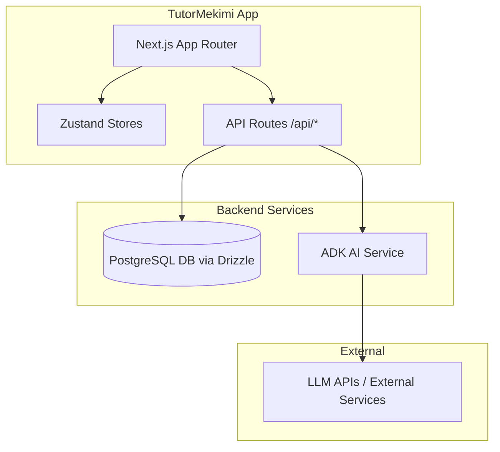

# Solocorn AI Development Context (GEMINI.md)

This file serves as the comprehensive instruction and contextual reference for Gemini CLI (and other AI agents) working in this workspace.

---

## 1. Project Overview & Architecture

Solocorn (also marketed as CogniClass / TutorMekimi) is an AI-human hybrid tutoring platform offering 24/7 Socratic AI tutoring alongside live group clinics led by human tutors. 

### Core Capabilities
* **Socratic AI Tutors:** Guide students via guided questions instead of providing direct answers.
* **Live Clinics:** Allows 1 tutor to manage up to 50 students using real-time AI monitoring and collaborative tools.
* **Whiteboard & Collaboration:** Shared interactive whiteboard utilizing `tldraw`, `Yjs`, and `Fabric.js` alongside real-time Socket.io state.
* **Multi-Role Dashboards:** Customized layouts and workflows for four distinct roles: **Student**, **Tutor**, **Parent**, and **Admin**.
* **Global Support:** 10 configured locales with initial translation dictionaries for English (`en`) and Chinese (`zh-CN`).

### System Architecture



---

## 2. Workspace & Repository Layout

This is a **polyglot monorepo with no root `package.json`**. Each sub-project manages its own dependencies independently.

```
/Users/nazeera/Documents/Tutor/
├── tutorme-app/              # Main Next.js App (All Backend + Primary Frontend)
│   ├── src/
│   │   ├── app/              # Next.js App Router
│   │   │   ├── [locale]/     # i18n dashboards for Student, Tutor, Parent, Admin
│   │   │   └── api/          # REST API endpoints (~243 route.ts files)
│   │   ├── components/       # React components (feature-organized)
│   │   ├── lib/              # Database, AI modules, security, payments, etc.
│   │   ├── hooks/            # Custom React hooks
│   │   └── stores/           # Zustand client stores
│   ├── drizzle/              # Drizzle SQL migration files (87+ migrations)
│   ├── messages/             # i18n dictionaries (en.json, zh-CN.json)
│   ├── server.ts             # Custom Express-based Next.js server with Socket.io
│   ├── vitest.config.ts      # Unit/Integration test setups
│   └── package.json          # Sub-project dependencies & run scripts
│
├── landing-page/             # Vite 6 + React 19 + TypeScript Marketing Site
│   ├── src/                  # App components and layout
│   └── package.json          # Landing page configurations (runs on :3000)
│
├── services/adk/             # Optional Google ADK Express + TypeScript Service
│   ├── src/                  # AI agent definitions (Tutor, Supervisor, etc.)
│   └── package.json          # ADK dependencies (runs on :8080/4310)
│
├── design-system/            # Shared design tokens & design system rules
│   └── solocorn/MASTER.md    # Standard typography, color palette, and component specs
│
└── scripts/                  # Operations, sync, and deploy utilities
```

---

## 3. Building, Running, and Testing

All sub-projects are run and built from their respective subdirectories.

### A. Main Web App (`tutorme-app/`)

#### Running & Development
> **Crucial:** Never run `next dev` directly. The app utilizes a custom server (`server.ts`) to handle early port-binding (health checks) and initialization (Socket.io).
```bash
cd tutorme-app
npm run dev               # Starts custom server at http://localhost:3003
npm run dev:next          # PORT=3003 next dev (No Socket.io, fallback only)
```

#### Production Build
```bash
npm run build             # Compiles Service Worker + runs next build
npm run start             # Standard production startup (within Docker)
```

#### Testing
The project features a comprehensive testing matrix:
```bash
npm run test              # Run unit tests via Vitest (jsdom, no DB needed)
npm run test:watch        # Watch-mode unit tests
npm run test:integration  # Runs integration tests (Requires Postgres)
npm run test:e2e          # Runs E2E tests via Playwright (Requires app on :3003)
npm run test:e2e:ui       # Playwright E2E with UI runner
npm run test:e2e:a11y     # Runs accessibility-specific E2E tests
```

#### Database (Drizzle ORM)
```bash
npm run drizzle:generate  # Generate migration files from schema changes
npm run db:migrate        # Execute pending database migrations locally
npm run db:check-schema   # Detect local vs. DB schema drift
npm run db:seed           # Seed sample dataset
npm run db:seed:admin     # Seed core admin credentials
npm run drizzle:studio    # Open Drizzle interactive visual database viewer
```

---

### B. Landing Page (`landing-page/`)
* Built with React 19, Vite 6, and Tailwind CSS v4.
* Production static bundle (`dist/`) is built and copied into `tutorme-app/public/` to be served by the main app at root `/`.
```bash
cd landing-page
npm run dev               # Runs Vite local server on http://localhost:3000
npm run build             # Compiles static export to dist/
```

---

### C. ADK AI Service (`services/adk/`)
* Google ADK Express + TypeScript microservice for specialized agent behaviors.
```bash
cd services/adk
npm run dev               # Runs ADK service locally on port 8080 (Mapped to 4310 via Docker)
npm run build             # Builds production bundle
npm run test              # Runs ADK native tests
```

---

## 4. Coding & Architectural Conventions

To maintain alignment and safety, follow these codebase-specific guidelines:

### A. Local-First Batching Workflow (Mandatory)
1. **Local Incubation:** Always run development commands inside `tutorme-app`. Iterate and test locally on `http://localhost:3003` under local branches `feature/[name]`. Avoid pushing numerous minor commits.
2. **Pre-Flight Validation:** Prior to requesting a pull request or pushing, you **must** successfully run and pass:
   * `npm run format` (Styling & code quality check)
   * `npm run build` (Ensures compilation and strict TypeScript validation succeeds)
   * `npm audit fix` (Security vulnerability mitigation)
3. **Strict Cleanliness:** NEVER commit `.env` or `.env.local` configuration files.

### B. Database Access
* **Primary Client:** Use the singleton defined in `src/lib/db/drizzle.ts` (`drizzleDb`) for all new features.
* **Schema Sourcing:** All schema definitions are structured in domains under `src/lib/db/schema/tables/`. Avoid manual raw DB manipulations. Use migrations.

### C. Code Style & Formats
* **Formatting:** Prettier standard with no semicolons, single quotes, 100 print width limit, and automatic Tailwind CSS class sorting (using `prettier-plugin-tailwindcss`).
* **Naming Conventions:**
  * Component files: PascalCase (e.g. `UserDashboard.tsx`).
  * Folders, API routes, and non-component files: kebab-case (e.g. `api-docs/`, `live-session.ts`).
  * DB Tables: PascalCase.
  * Constants: UPPER_SNAKE_CASE.
* **TypeScript Rules:** Use strict mode (`strict: true`). Explicitly type return values on exported functions. Do not use `any` bypass type guards. Use path alias `@/*` -> `src/*`.

### D. Security Controls
* Secure RBAC middleware checks are located in `src/lib/api/middleware.ts`.
* Avoid utilizing native `eval` or `new Function()`.
* Rate-limiting, CSRF tokens, and PIPL regulatory compliances must be preserved.

---

## 5. Design System Tokens (`design-system/solocorn/MASTER.md`)

When adding or styling UI elements, adhere to these global design tokens:

### Colors
* **Primary Purple:** `#7C3AED` (`--color-primary`)
* **Secondary Purple:** `#A78BFA` (`--color-secondary`)
* **Accent / CTA Cyan:** `#0891B2` (`--color-accent`)
* **Background:** `#FAF5FF` (`--color-background`)
* **Foreground:** `#1E1B4B` (`--color-foreground`)
* **Muted Base:** `#ECEEF9` (`--color-muted`)
* **Border Lines:** `#DDD6FE` (`--color-border`)

### Typography
* **Heading Font:** Fira Code
* **Body Font:** Fira Sans
* **Theme Mood:** Technical, precise, data-oriented, and analytics-driven dashboard.

---

## 6. Primary Environment Configuration

Key environment variables required for standard operation (to be written to `.env.local` inside `tutorme-app/` for local testing):

| Variable Name | Description | Key Sub-Project |
| --- | --- | --- |
| `DATABASE_URL` | PostgreSQL connection string | Shared |
| `REDIS_URL` | Cache and Socket.io state sync url | `tutorme-app` |
| `NEXTAUTH_SECRET` | Secret key for local session encryption | `tutorme-app` |
| `NEXTAUTH_URL` | Authentication callback URL (`http://localhost:3003`) | `tutorme-app` |
| `KIMI_API_KEY` | Moonshot Kimi K2.5 key (Primary AI) | Shared |
| `GEMINI_API_KEY` | Gemini LLM Provider key (Secondary AI) | Shared |
| `DAILY_API_KEY` | Daily.co API key for collaborative live video streaming | `tutorme-app` |
| `ADK_BASE_URL` | Express ADK local URL endpoint | `tutorme-app` |
