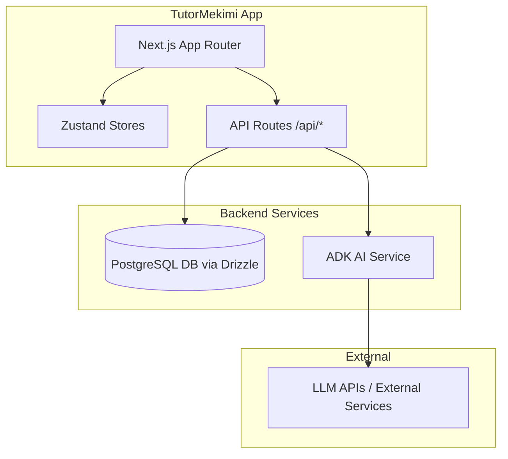

# Solocorn AI Development Rules (Feature Batching Edition)

## Project Structure
- Main App: Located in `./tutorme-app`
- Deployment: GCP Cloud Run (via GitHub Actions)

## System Architecture



## Setup & Execution
The primary entry point to set up the entire project locally is the setup script:
```bash
./scripts/setup.sh
```

## Environment Variable Matrix
| Variable | Shared / Service-Specific | Description |
|---|---|---|
| `DATABASE_URL` | Shared | PostgreSQL connection string used by both `tutorme-app` and services. |
| `NEXTAUTH_SECRET` | `tutorme-app` | Secret key for NextAuth.js session encryption. |
| `NEXTAUTH_URL` | `tutorme-app` | Base URL for authentication callbacks. |
| `ADK_API_KEY` | `services/adk` | API key for the ADK AI Service. |
| `OPENAI_API_KEY` | Shared | OpenAI key for LLM features. |

## Autonomous Workflow Requirements
When a feature request is made, follow the "Local-First" batching strategy:

1. **Incubation (Local Development)**:
   - Always `cd tutorme-app` for terminal commands.
   - Develop the feature entirely on a local branch (`feature/[name]`).
   - Use `http://localhost:3003` for all iterative testing.
   - Do NOT push to GitHub after every small change. Accumulate related features/fixes locally first.

2. **Pre-Flight Validation**:
   - Before suggesting a push, you MUST successfully run the full suite:
     - `npm run format` (Style check)
     - `npm run build` (Next.js/TypeScript check)
     - `npm audit fix` (Security check)

3. **Atomic Commits**:
   - Create clear, descriptive local commits for each sub-task (e.g., `git commit -m "feat: added login form UI"`).

4. **Batch Deployment**:
   - Only when the entire "bundle" of features is verified locally, run `git push origin [branch]`.
   - Notify the user that a single "Feature Batch" is ready for review on a Preview URL.

5. **Security & Cleanliness**:
   - NEVER commit `.env` or `.env.local`.
   - Ensure `npm run build` passes 100% before the final push.