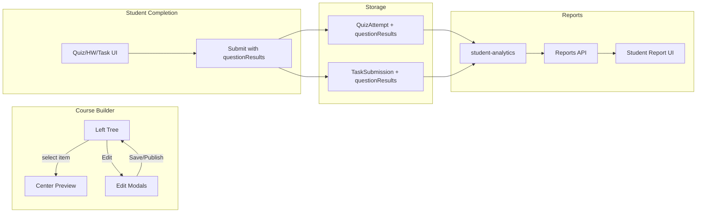

# Course Builder: Preview Panel, Question Preview/Edit, and Per-Question Analytics

## Current State Summary

- **Layout**: [CourseBuilder.tsx](tutorme-app/src/app/tutor/dashboard/components/CourseBuilder.tsx) has three panels: Left (col-span-4) course tree + AI prompt, **Center (col-span-5) "Preview"** — currently a static placeholder ("Select an item from the left to preview"); Right (col-span-3) AI Assistant, Templates, Stats.
- **Selection**: `selectedItem` state exists (line 1777) but is **never set**; clicking a quiz/homework/task opens a **modal** (TaskBuilderModal, HomeworkBuilderModal, QuizBuilderModal) for editing. There is no "select then show in middle panel" behavior.
- **Editing**: Quiz/Homework/Task are edited only in modals. Questions are created/edited there (e.g. Task lines 814–824, QuizBuilderModal). There is no separate "preview then publish" flow; saving from the modal writes directly into in-memory `modules`.
- **Persistence**: [CourseBuilderContent.tsx](tutorme-app/src/app/tutor/courses/components/CourseBuilderContent.tsx) `handleSave` only logs and toasts; curriculum is not yet persisted to an API (initialModules is hardcoded).
- **Attempt/Submission models**:
  - [QuizAttempt](tutorme-app/prisma/schema.prisma) (lines 734–749): `answers` (Json), `score`, `maxScore`, `timeSpent`, `feedback` — no structured **per-question** result.
  - [TaskSubmission](tutorme-app/prisma/schema.prisma) (382–410): `answers` (Json), `score`, `maxScore` — same; no per-question breakdown.
- **Reports**: [getStudentPerformance](tutorme-app/src/lib/performance/student-analytics.ts) and [reports API](tutorme-app/src/app/api/reports/students/[studentId]/route.ts) use aggregated task history and commonMistakes; no per-question drill-down.

---

## 1. Middle Section: Preview of Selected Quiz / Homework / Task

**Goal**: When a tutor selects a quiz, homework, or task in the left tree, the **center panel** shows a read-only (or inline-editable) preview of that item, including all questions and metadata, instead of the placeholder.

**Implementation**:

- **Wire selection to center panel**
  - On click of a **task**, **homework**, or **quiz** node in the tree (in addition to or instead of opening the modal), set `selectedItem` to `{ type: 'task'|'homework'|'quiz'|'moduleQuiz', id }` and optionally open the modal only when "Edit" is clicked from the preview.
  - Resolve the selected item from `modules` (find lesson → tasks/homework/quizzes or module → moduleQuizzes by `id`).
- **Center panel content**
  - If `selectedItem === null`: keep current placeholder ("Select an item from the left to preview").
  - If `selectedItem` is set: render a **PreviewCard** component that shows:
    - Title, description, instructions, points, time limit (if any), submission type, etc.
    - **Full list of questions** with: type (MCQ/T/F/short/essay), question text, options (for MCQ), points per question, explanation (if any). Do **not** show correct answers or answer key in student-facing preview mode; optionally show "Answer key hidden" for tutor.
  - Provide actions: **Edit** (opens existing Task/Homework/QuizBuilderModal with same item), **Duplicate**, **Remove** (with confirm). Optionally **Preview as student** (hide answer key, show one question at a time).
- **Optional**: Clicking a **lesson** could set `selectedItem` to the lesson and show a lesson summary preview (media count, docs, content count, tasks/homework/quizzes list) with "Edit" opening LessonBuilderModal.

**Files to touch**:

- [CourseBuilder.tsx](tutorme-app/src/app/tutor/dashboard/components/CourseBuilder.tsx): set `selectedItem` on task/homework/quiz (and optionally lesson) click; render PreviewCard in center panel; pass `onEdit` that opens the correct modal with `editingData` and `activeModal` set.

---

## 2. Tutor Preview and Edit Questions Before Saving or Publishing

**Goal**: When a question is first created (or when editing a quiz/homework/task), tutors can **preview and edit everything** (including each question's text, options, points, explanation, answer key) **before** saving or making the item available to students.

**Current behavior**: Modals already allow full edit (questions, points, options, explanation, answer key). What's missing is:

- A clear **preview-before-publish** flow: e.g. "Preview" tab inside the modal or in the center panel showing exactly what students will see (no answer key), and "Save as draft" vs "Publish to students".
- **Publish/draft state** so that saving does not automatically make the item visible to students.

**Implementation**:

- **Draft vs published (optional but recommended)**
  - Add to the in-memory types (and later to persisted schema if curriculum is stored in DB): e.g. `isPublished?: boolean` or `status: 'draft' | 'published'` on Quiz, Homework, Task. When saving from the builder, default to draft unless the tutor explicitly clicks "Publish" or "Make available to students".
  - In the builder modals, add actions: **Save (draft)** and **Publish** (or "Save and make available"). Center panel preview can show a "Draft" badge when not published.
- **Preview inside creation flow**
  - In **QuizBuilderModal**, **HomeworkBuilderModal**, and **TaskBuilderModal** (when `submissionType === 'questions'`):
    - Add a **Preview** mode/tab: render the item as students would see it (questions only, no correct answers, no answer key). Allow toggling between "Edit" and "Preview" so tutors can check each question before saving.
  - Reuse the same question-render logic as in the center panel PreviewCard (or a shared `QuestionPreview` component) so that "what you see in Preview" matches what students see.
- **Edit everything before save**
  - Already supported: title, description, instructions, points, time limit, each question (text, type, options, points, explanation), answer key (instructor-only). Ensure **all** of these are editable in the modal and reflected in the center panel when the item is selected. No "save then edit" — all edits are in-memory until the tutor clicks Save/Publish.

**Files to touch**:

- [CourseBuilder.tsx](tutorme-app/src/app/tutor/dashboard/components/CourseBuilder.tsx): Add Preview tab/mode and optional draft/publish to TaskBuilderModal, HomeworkBuilderModal, QuizBuilderModal; optional `isPublished`/`status` on types and in DEFAULT_* and save handlers.
- Optionally extract a shared `QuestionPreview` / `QuizHomeworkTaskPreview` component used by both center panel and modals.

---

## 3. Per-Question Completion Data Capture and Storage

**Goal**: When students complete a quiz, homework, or task, capture **per-question** details (e.g. questionId, correct/incorrect, points earned, time per question, selected answer) and store them so they can be analyzed and pushed into report variables.

**Implementation**:

- **Schema changes (Prisma)**
  - **QuizAttempt**: Keep existing fields; add optional `questionResults` Json (array of `{ questionId, correct, pointsEarned, pointsMax, selectedAnswer?, timeSpentSec? }`) so that existing APIs can stay backward-compatible while new clients send per-question data.
  - **TaskSubmission**: Similarly add optional `questionResults` Json (same shape or similar) for question-based tasks. Keep `answers` and `score`/`maxScore` for backward compatibility.
  - Optional: Add a dedicated table `QuizAttemptQuestion` / `TaskSubmissionQuestion` (attemptId/submissionId, questionId, correct, pointsEarned, selectedAnswer, etc.) for easier querying and reporting; then the report layer can use either the Json or the normalized table.
- **API and client**
  - **POST /api/quiz/attempt**: Accept an optional `questionResults` array in the body; validate and store in `QuizAttempt.questionResults` (or in a child table). Continue to accept `score`, `maxScore`, `answers` for backward compatibility.
  - **Task submission API** (wherever task completion is submitted): Accept optional `questionResults`; store on `TaskSubmission`.
  - Student-facing quiz/task UI: When submitting, send per-question results (questionId, correct, pointsEarned, selectedAnswer) so that the backend can persist them.

**Files to touch**:

- [prisma/schema.prisma](tutorme-app/prisma/schema.prisma): Add `questionResults Json?` to QuizAttempt and TaskSubmission (and optional normalized tables if desired); run migration.
- [api/quiz/attempt/route.ts](tutorme-app/src/app/api/quiz/attempt/route.ts): Accept and persist `questionResults`.
- Task submission endpoint(s): Same for TaskSubmission (e.g. [task-generator.ts](tutorme-app/src/lib/ai/task-generator.ts) submitTask or dedicated API). Ensure generated task submissions also store per-question data when available.
- Quiz/task completion components: Send `questionResults` when present (e.g. [quiz-modal.tsx](tutorme-app/src/components/quiz/quiz-modal.tsx), any task submission form).

---

## 4. Analysis and Report Variables for Tutor Decisions

**Goal**: Detailed data on how each student did on each question is **analyzed** and **pushed to the appropriate variables** used by reports and tutor decision tools.

**Implementation**:

- **Analytics layer**
  - In [student-analytics.ts](tutorme-app/src/lib/performance/student-analytics.ts) (or a new `question-level-analytics.ts`):
    - Add functions that read `QuizAttempt.questionResults` and `TaskSubmission.questionResults` (or normalized tables) and aggregate:
      - Per-student: which questionIds were correct/incorrect, points per question, weak question IDs.
      - Per-question (across students): difficulty (e.g. % correct), common wrong answers, list of students who got it wrong.
  - **Update or extend** `StudentPerformance` / report payload:
    - Add fields such as `questionLevelBreakdown` (Json) or `weakQuestionIds`, `perQuizAttemptDetails` (array of { quizId, attemptId, questionResults }) so that the report API can return per-question detail.
  - **Push to existing report variables**: Ensure `taskHistory`, `commonMistakes`, `strengths`, `weaknesses` (and any existing report structures) are **derived from or enriched by** the new per-question data (e.g. commonMistakes include "Question X: often chose Y").
- **Report API and UI**
  - [GET /api/reports/students/[studentId]](tutorme-app/src/app/api/reports/students/[studentId]/route.ts): Optionally accept `includeQuestionLevel=true` and return per-question breakdown for quizzes/tasks (e.g. by quizId/taskId, then by questionId with correct/incorrect, points).
  - [Student report page](tutorme-app/src/app/tutor/reports/[studentId]/page.tsx): Add a section or tab "Question-level detail" (e.g. table or list: Quiz/Task name → Question → Correct/Incorrect, points, optional selected answer). Use this for "further decision on each student" as requested.

**Files to touch**:

- [prisma/schema.prisma](tutorme-app/prisma/schema.prisma): Optionally extend `StudentPerformance` with Json fields for question-level breakdown if not using only attempt/submission tables.
- [lib/performance/student-analytics.ts](tutorme-app/src/lib/performance/student-analytics.ts): New helpers to compute per-question stats and merge into taskHistory/commonMistakes/strengths/weaknesses.
- [api/reports/students/[studentId]/route.ts](tutorme-app/src/app/api/reports/students/[studentId]/route.ts): Return question-level data when requested; call new analytics helpers.
- [reports/[studentId]/page.tsx](tutorme-app/src/app/tutor/reports/[studentId]/page.tsx): New subsection/tab for per-question details with tables or expandable rows.

---

## 5. Data Flow Diagram (Conceptual)

---

## 6. Suggested Implementation Order

1. **Middle panel preview**: Wire `selectedItem`, resolve selected quiz/homework/task from `modules`, and render PreviewCard in center (read-only + Edit/Duplicate/Remove). No schema changes.
2. **Preview-before-publish in modals**: Add Preview tab and optional draft/publish in Task/Homework/Quiz modals; reuse preview component where possible.
3. **Per-question storage**: Add `questionResults` (and optional normalized table) to QuizAttempt and TaskSubmission; migration; update quiz attempt and task submission APIs and clients.
4. **Analytics and report variables**: Implement question-level aggregation in student-analytics, extend report API response, add "Question-level detail" to the student report page.

---

## 7. Deliverable

This implementation plan has been saved to **Task12.md** in the project root. The above sections describe the full plan so the team can execute or extend it step by step.
